# Počítačové videnie - úloha 1

**Autor: Martin Šváb**

## Rakovinotvorné bunky

### Vstup

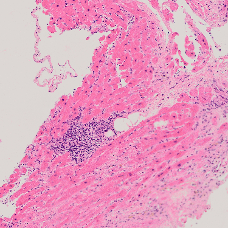

### Červený kanál

Z pôvodného obrázku vyberieme červený kanál, lebo v ňom sú rakovinotvorné bunky najviditeľnejšie.

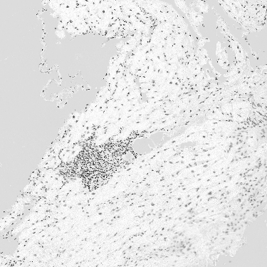

### Threshold

Pomocou thresholdu detekujeme rakovinotvorné bunky.

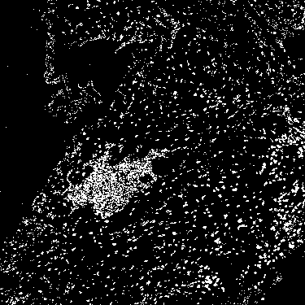

### Výstup

Kontúrovou detekciou bolo nájdených 1179 rakovinotvorných buniek.

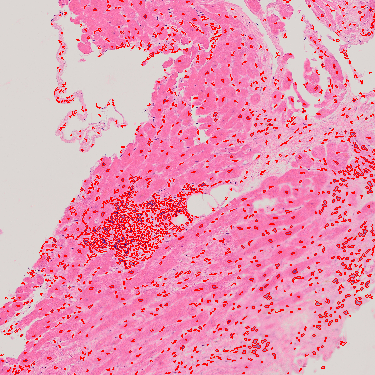

## Pivné bublinky

### Vstup

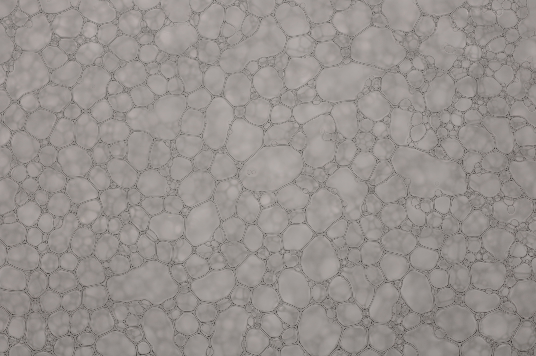

### Grayscale

Z obrázku odstránime farby na jednoduchšie spracovanie.

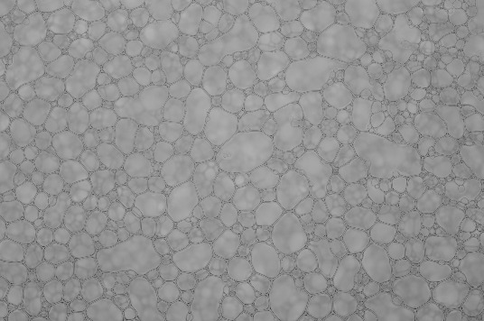

### Canny

Pri správnom nastavení threshold hodnôt môžeme detekovať hrany pivných bubliniek.

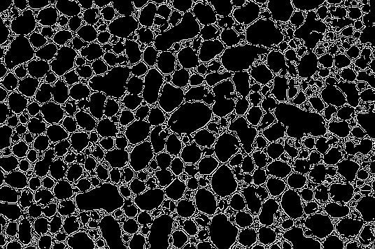

### Dilácia

Pomocou dilácie odstránime medzeru medzi bublinkami a spojíme niektoré prerušené hrany bubliniek.

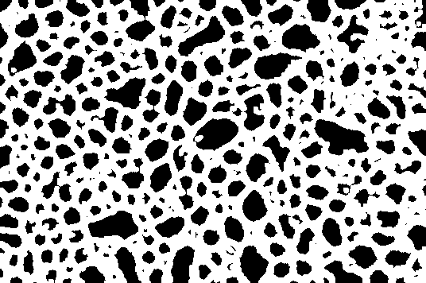

### Erózia

Pomocou erózie získame pôvodnú veľkosť bubliniek.

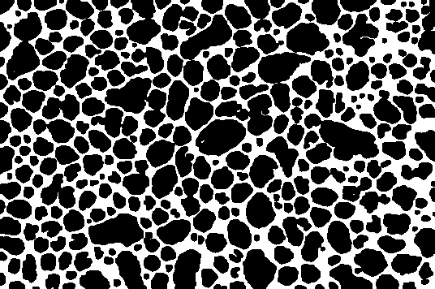

### Výstup

Kontúrovou detekciou bolo nájdených 238 pivných bubliniek.

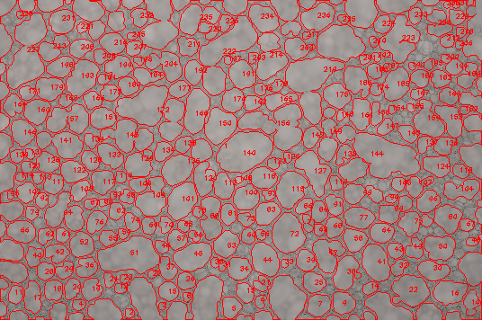

## Červené krvinky

### Vstup

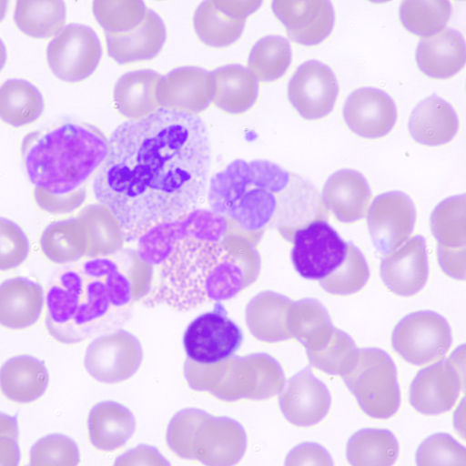

### Zelený kanál

Z pôvodného obrázku vyberieme červený kanál, lebo v ňom sú najviditeľnejšie biele krvinky, ktoré potrebujeme pri spracovaní odstrániť.

### Gauss

Pomocou gaussovej filtrácie rozmažeme obrázok a odstránime artefakty.

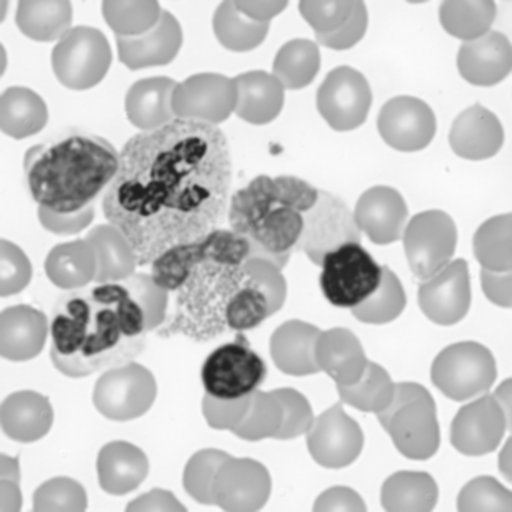

### Všetky krvinky

Pomocou znegovaného thresholdu vyberieme všetky krvinky.

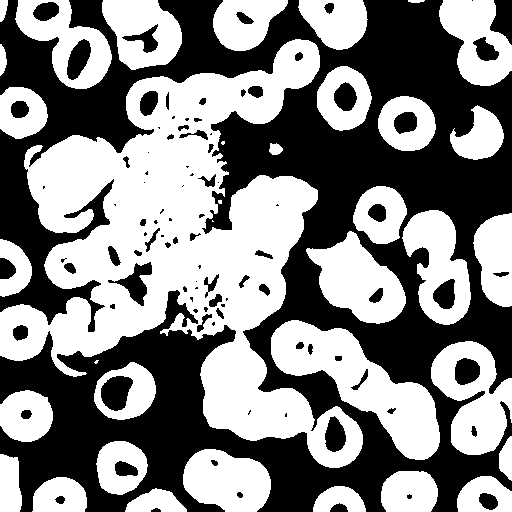

### Biele krvinky

Pomocou znegovaného thresholdu s nižšou hodnotou ako v predošlom obrázku vyberieme všetky biele krvinky.

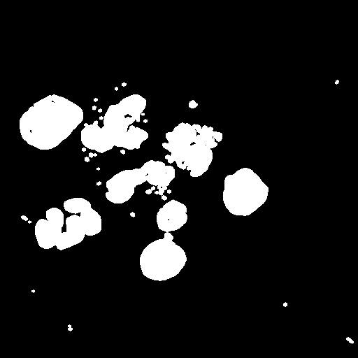

### Červené krvinky

Odčítaním bielych krviniek od všetkých krviniek získame červené krvinky

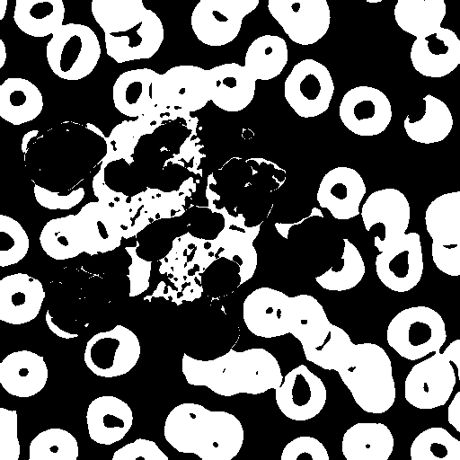

### Erózia

Pomocou erózie od seba oddelíme niektoré červené krvinky. 

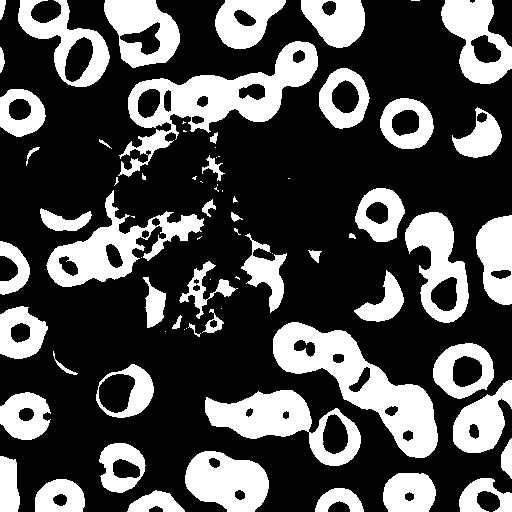

### Výstup

Kontúrovou detekciou bolo nájdených 38 červených krviniek.

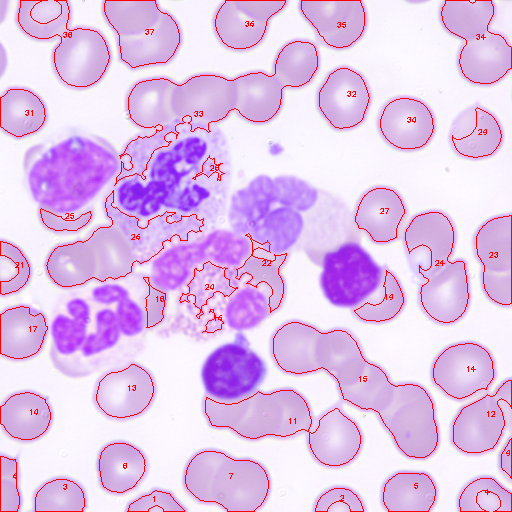
