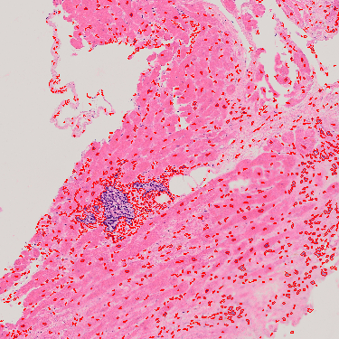

# Počítačové videnie - úloha 1

**Autor: Martin Šváb**

## Rakovinotvorné bunky

### Vstup

Vstupný obrázok mal veľké rozlíšenie, takže sme ho pre lepšie zobrazovanie zmenšili na 1/8 pôvodnej veľkosti.

	cv::Mat input = cv::imread(inputPath);
	cv::resize(input, input, cv::Size(input.cols / 8, input.rows / 8));

### Červený kanál

Z pôvodného obrázku vyberieme červený kanál, lebo v ňom sú rakovinotvorné bunky viditeľnejšie ako v grayscale obrázku a zelenom/modrom kanálu.

	std::vector<cv::Mat> channels;
	cv::split(input, channels);
	cv::Mat red = channels[2];

### Threshold

Pomocou globálneho thresholdu sme zbinarizovali náš obrázok. Experimentálne sme zistili, že pri danom obrázku je najlepšia hodnota thresholdu 215. Tento obrázok znegujeme aby sme mali rakovinotvorné bunky označené bielou farbou.

	cv::Mat threshold;
	cv::threshold(red, threshold, 215, 255, cv::THRESH_BINARY);
	cv::bitwise_not(threshold, threshold);

### Výstup

Jednoduchou kontúrovou detekciou (CHAIN\_APPROX\_SIMPLE) bolo nájdených 955 rakovinotvorných buniek. Detekujeme externé hrany, lebo nepredpokladáme, že rakovinotvorné bunky budú mať hrany vo vnútri. Detekované kontúry žiadnym spôsobom nefiltrujeme.

	std::vector<std::vector<cv::Point>> contours;
	cv::findContours(processed, contours, cv::RETR_EXTERNAL, cv::CHAIN_APPROX_SIMPLE);

## Pivné bublinky

### Vstup

Vstupný obrázok mal veľké rozlíšenie, takže sme ho pre lepšie zobrazovanie zmenšili na 1/8 pôvodnej veľkosti.

	cv::Mat input = cv::imread(inputPath);
	cv::resize(input, input, cv::Size(input.cols / 8, input.rows / 8));

### Grayscale

Z obrázku odstránime farby na jednoduchšie spracovanie. V jednotlivých farebných kanáloch sme nevideli žiadne zlepšenie.

	cv::Mat grayscale;
	cv::cvtColor(input, grayscale, cv::COLOR_BGR2GRAY);

### Canny

Pomocou canny algoritmu detekujeme hrany v obrázku. Využívame štruktúrny element o veľkosti 6x6 v tvare elipsy. Experimentálne sme zistili, že pri danom obrázku sú najlepšie hodnoty thresholdov 60 (hrany pod týmto thresholdom sú určite nesprávne), 80 (hrany nad týmto thresholdom sú určite správne).

	cv::Mat canny;
	cv::Canny(grayscale, canny, 60, 80);

### Dilácia

Pomocou dilácie odstránime medzeru medzi bublinkami a spojíme niektoré prerušené hrany bubliniek. Využívame štruktúrny element o veľkosti 6x6 v tvare elipsy.

	cv::Mat kernel = cv::getStructuringElement(cv::MORPH_ELLIPSE, cv::Size(6, 6));

	cv::Mat dilate;
	cv::dilate(canny, dilate, kernel);

### Erózia

Pomocou erózie získame pôvodnú veľkosť bubliniek. Využívame rovnaký štrukturálny element ako pri dilácii. Vykonaním operácie dilácie a následne erózie s tým istým štrukturálnym elementom sme vykonali operáciu zatvorenia. 

	cv::Mat erode;
	cv::erode(dilate, erode, kernel);

### Výstup

Jednoduchou kontúrovou detekciou (CHAIN\_APPROX\_SIMPLE) kontúrovou detekciou bolo nájdených 238 pivných bubliniek. Detekujeme všetky hrany. Pomocou minimálnej veľkosti kontúry 50 odfiltrujeme detekované kontúry.

	int objectCount = 0;

	std::vector<std::vector<cv::Point>> contours;
	cv::findContours(processed, contours, cv::RETR_CCOMP, cv::CHAIN_APPROX_SIMPLE);

	for (int i = 0; i < contours.size(); ++i) {
		std::vector<cv::Point> points = contours[i];

		if (cv::contourArea(points) > 50) {
			objectCount++

			// see code for more details about drawing
		}
	}

## Červené krvinky

### Vstup

Vstupný obrázok mal vhodné rozlíšenie, takže sme jeho veľkosť nemenili.

	cv::Mat input = cv::imread(inputPath);

### Zelený kanál

Z pôvodného obrázku vyberieme červený kanál, lebo v ňom sú najviditeľnejšie biele krvinky, ktoré potrebujeme pri spracovaní odstrániť.

	std::vector<cv::Mat> channels;
	cv::split(input, channels);
	cv::Mat green = channels[1];

### Gauss

Pomocou gaussovej filtrácie s kernelom veľkosti 5x5 rozmažeme obrázok a odstránime artefakty.

	cv::Mat gauss;
	cv::GaussianBlur(green, gauss, cv::Size(5, 5), 0);

### Všetky krvinky

Pomocou znegovaného globálneho thresholdu s hodnotou thresholdu 200 (zistené experimentálne) sme zbinarizovali náš obrázok a získali všetky krvinky.

	cv::Mat allBloodCells;
	cv::threshold(gauss, allBloodCells, 200, 255, cv::THRESH_BINARY);
	cv::bitwise_not(allBloodCells, allBloodCells);

### Biele krvinky

Pomocou znegovaného globálneho thresholdu s hodnotou thresholdu 150 (zistené experimentálne) sme zbinarizovali náš obrázok a získali biele krvinky. Náš obrázok zväčšíme pomocou dilácie (5x5 elipsa).

	cv::Mat whiteBloodCells;
	cv::threshold(green, whiteBloodCells, 150, 255, cv::THRESH_BINARY);
	cv::bitwise_not(whiteBloodCells, whiteBloodCells);

	cv::Mat kernel = cv::getStructuringElement(cv::MORPH_ELLIPSE, cv::Size(5, 5));
	cv::dilate(whiteBloodCells, whiteBloodCells, kernel);

### Červené krvinky

Odčítaním bielych krviniek od všetkých krviniek získame červené krvinky.

	cv::Mat redBloodCells;
	cv::subtract(allBloodCells, whiteBloodCells, redBloodCells);

### Erózia

Pomocou erózie od seba oddelíme niektoré červené krvinky. Využívame štruktúrny element o veľkosti 5x5 v tvare elipsy. 

	cv::Mat kernel = cv::getStructuringElement(cv::MORPH_ELLIPSE, cv::Size(5, 5));

	cv::Mat erode;
	cv::erode(redBloodCells, erode, kernel);

### Výstup

Jednoduchou kontúrovou detekciou (CHAIN\_APPROX\_SIMPLE) bolo nájdených 38 červených krviniek. Detekujeme externé hrany, lebo nepredpokladáme, aby neboli detekované hrany vnútri červených krviniek. Pomocou minimálnej veľkosti kontúry 100 odfiltrujeme detekované kontúry.

	int objectCount = 0;

	std::vector<std::vector<cv::Point>> contours;
	cv::findContours(processed, contours, cv::RETR_EXTERNAL, cv::CHAIN_APPROX_SIMPLE);

	for (int i = 0; i < contours.size(); ++i) {
		std::vector<cv::Point> points = contours[i];

		if (cv::contourArea(points) > 100) {
			objectCount++

			// see code for more details about drawing
		}
	}

